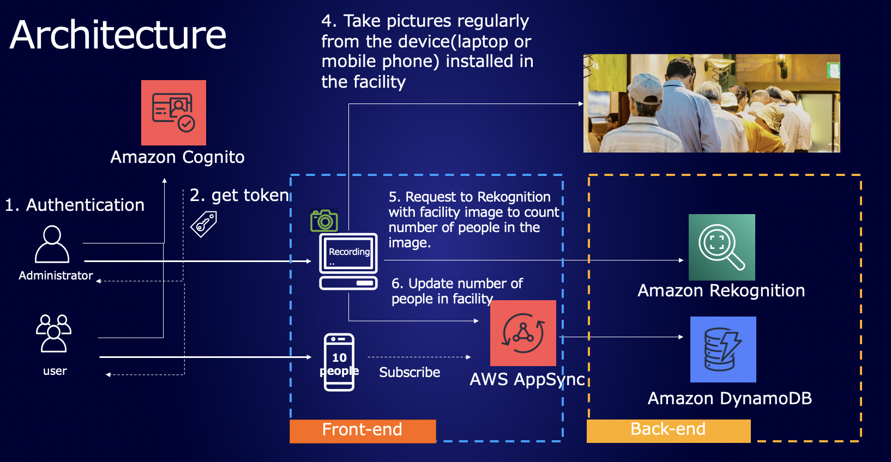
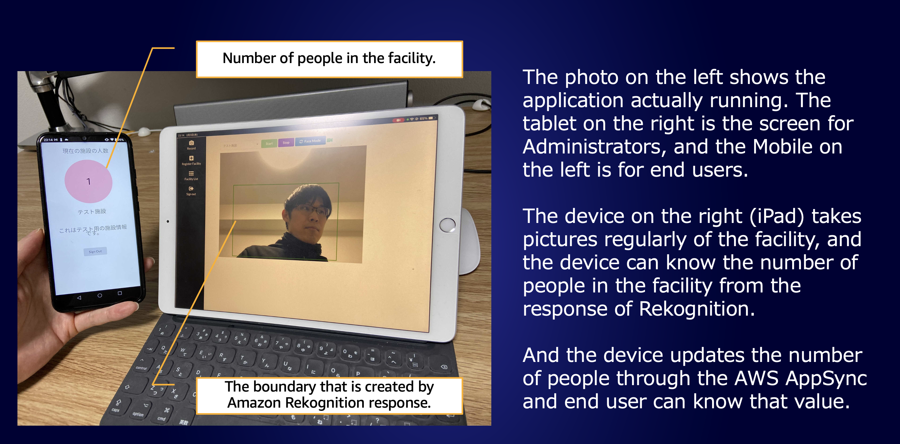

# Amazon Rekognition congestion monitoring with AWS Amplify

This is a sample web application for monitoring facility congestion using Amazon Rekognition.
Images taken with a webcam are sent to the cloud, and the number of people in the images is calculated based on the response of Amazon Rekognition. Using AWS AppSync to notify end users of the number of facilities in real time. The backend of this application is developed by Amplify CLI.

## Architecture Overview





## Prerequisites

* AWS Account
* NodeJS with NPM
* AWS Amplify CLI(>=4.42.0)

## Getting Started

### Initialize Amplify Project

1. Clone this repo locally

```bash
git clone <git repo url>
```

2. Initialize the amplify project

```bash
amplify init

? Enter a name for the project rekognitioncongestionmonitoring

? Enter a name for the environment dev

? Choose your default editor: Visual Studio Code

? Choose the type of app that you're building javascript

Please tell us about your project
? What javascript framework are you using react

? Source Directory Path:  src

? Distribution Directory Path: build

? Build Command:  npm run-script build

? Start Command: npm run-script start

? Please choose the profile you want to use default
```

### Auth (Amazon Cognito)

1. Add Auth category with Amplify CLI

```bash
amplify add auth

? Do you want to use the default authentication and securit
y configuration? Default configuration

? How do you want users to be able to sign in? Username

? Do you want to configure advanced settings? No, I am done
```


### GraphQL API (AWS AppSync)

1. Add API category with CLI

```bash
amplify add api 

? Please select from one of the below mentioned services: GraphQL
? Provide API name: amplifychimesdk

? Choose the default authorization type for the API Amazon Cognito U
ser Pool
Use a Cognito user pool configured as a part of this project.

? Do you want to configure advanced settings for the GraphQL API No,
 I am done.
? Do you have an annotated GraphQL schema? No

? Choose a schema template: Single object with fields (e.g., “Todo” 
with ID, name, description)

? Do you want to edit the schema now? No
```

2. Define GraphQL Schema

Copy the schema at `amplify/backend/api/<api name>/schema.graphql`

```graphql
enum RecordingStatus {
  ACTIVE
  INACTIVE
}

type Facility
  @model
  @auth(
    rules: [
      { allow: private, operations: [read] }
      { allow: groups, groups: ["admin"] }
    ]
  ) {
  id: ID!
  name: String!
  numberOfPeople: Int!
  description: String
  recordingStatus: RecordingStatus
}
```
### Predictions (Amazon Rekognition)

1. Add Predictions category with CLI

```bash
amplify add api 

? Please select from one of the categories below
❯ Identify
  Convert
  Interpret
  Infer
  Learn More

? What would you like to identify?
  Identify Text
  Identify Entities
❯ Identify Labels
```

### Create the backend with CLI

```bash
amplify push -y
```

Creating the backend may take a few minutes.

## start application.

```bash
npm install
npm start
open localhost:3000
```

## Create Admin Account

You can create an account in application. The application checks if you have access administrator screen by finding out you in Cognito `admin` group. The account you created is not in `admin` group by default. You need to add administrator account into `admin` group by the below process.


### Create admin group
```bash
aws cognito-idp create-group --user-pool-id ${YOUR USER POOL ID} --group-name admin
```

### Add Admin Account to admin group
```bash
aws cognito-idp admin-add-user-to-group --user-pool-id ${YOUR USER POOL ID} --username ${ADMIN USER NAME YOU CREATED} --group-name admin
```

## Security

See [CONTRIBUTING](CONTRIBUTING.md#security-issue-notifications) for more information.

## License

This library is licensed under the MIT-0 License. See the LICENSE file.
